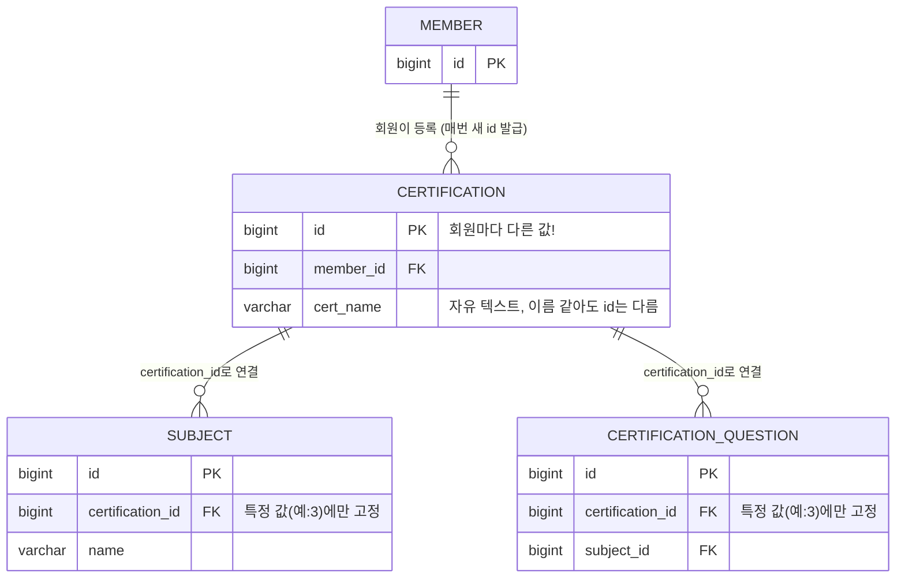
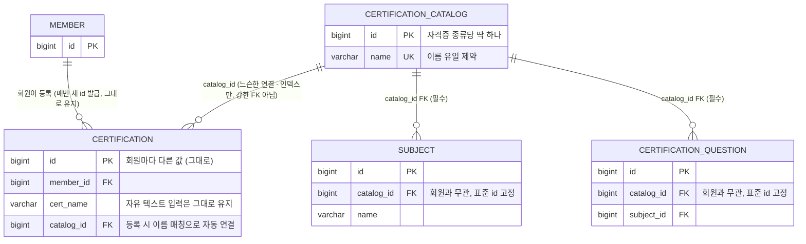

# 트러블슈팅 로그 — 2026-07-28
## 자격증 문제풀이 매칭 실패 — 스키마 설계 결함 진단 및 마스터 테이블 분리로 수정

### 배경

회원가입 후 로그인한 신규 회원이 "자격증 문제풀이"에서 "피부(스킨케어) 자격증"을 등록하면, 실제로는 해당 문제(157건)가 DB에 있는데도 "아직 등록된 문제가 없습니다" 화면만 뜨는 문제가 보고됨. 그런데 다른(먼저 가입한) 회원 계정에서는 동일한 이름의 자격증으로 문제풀이가 정상 동작함 — 같은 기능인데 계정에 따라 되고 안 되는 현상.

### 목표

증상의 원인을 스키마 레벨에서 진단하고, `certification_catalog`(자격증 종류 마스터) 테이블을 도입해 실제로 수정한다. AS-IS/TO-BE ERD로 구조 변화를 남기고, 실제 마이그레이션 적용 과정에서 만난 에러와 로컬 검증 결과까지 기록한다.

---

### 원인 — `certification_id`가 "회원 개인 기록 id"와 "문제은행 식별자"를 겸하고 있었음

`certification` 테이블은 회원이 "내 자격증"을 추가할 때마다 새로운 행이 생기는 **개인별 트래킹 레코드**다. `id`는 회원마다 제각각 다른 값으로 auto_increment 발급된다.

그런데 실제 시험 문제은행(`certification_question`, `subject`)은 이 개인별 `certification.id` 중 **딱 하나의 특정 값**에만 고정 연결되어 있었다. 그 값을 우연히 발급받은 회원(대부분 가장 먼저 만든 계정)만 문제가 보이고, 나머지 회원은 매칭되는 문제가 하나도 없어서 "아직 등록된 문제가 없습니다" 화면으로 빠진다.

과거 마이그레이션 이력(`sql/006_fix_local_subject_mismatch.sql`, `sql/007_classify_beauty_subject.sql`, `sql/008_fix_beauty_certification_id.sql`)을 보면, 이 문제가 "로컬 DB는 피부자격증 id가 3번, EC2는 1번이라 서로 안 맞음" 형태로 이미 여러 번 터졌었고, 그때마다 숫자를 하드코딩으로 패치해온 것이 확인된다. 근본 원인은 그대로 둔 채 증상만 계속 고쳐온 상태였다.

#### AS-IS: 회원마다 다른 id가 발급되고, 문제은행은 그중 하나에만 고정



회원 A가 "피부(스킨케어) 자격증"을 등록해 `certification.id = 3`을 받으면 문제가 정상적으로 보이지만, 회원 B가 같은 이름으로 등록해 `id = 57`을 받으면 `subject`/`certification_question`이 바라보는 `certification_id = 3`과 안 맞아서 문제가 하나도 안 보인다.

---

### 개선 구조 — `certification_catalog`(자격증 종류 마스터) 도입

"자격증 종류"라는 개념을 별도의 표준 테이블로 분리하고, 문제은행(`subject`, `certification_question`)은 회원 개인 기록이 아니라 **이 표준 테이블의 id만 바라보도록** 구조를 바꾼다. 회원 개인의 `certification` 기록은 이 표준 테이블을 참조는 하되, 강하게 묶지는 않는다(아래 "FK 설계 조정" 참고 — 12개 역할 리뷰에서 나온 결론 반영).

#### TO-BE: 문제은행이 회원과 무관한 표준 id 하나만 바라봄



회원이 자격증을 추가하면(`CertificationService.save()`), 입력한 이름으로 `certification_catalog`를 찾거나 없으면 새로 만들어(`getOrCreateByName`) `catalog_id`를 자동으로 연결한다. 사용자 입력 화면(자유 텍스트 입력)은 그대로 두고, 매칭은 서버 내부에서 처리한다.

#### FK 설계 조정 — "FK 남발" 우려 반영

처음 설계안은 `certification`, `subject`, `certification_question` 세 곳 모두에 `catalog_id` FK를 강하게 거는 안이었으나, 12개 역할(아키텍처/DB 전문가 포함) 리뷰에서 과도한 정규화라는 지적이 나와 아래처럼 조정했다.

| 테이블 | 연결 방식 | 이유 |
|---|---|---|
| `subject.catalog_id` | **강한 FK** | 문제은행이 회원과 무관하게 항상 일관된 카탈로그를 가리켜야 이번 버그가 재발하지 않음 — 참조 무결성이 실제로 버그를 막아주는 지점 |
| `certification_question.catalog_id` | **강한 FK** | 위와 동일 |
| `certification.catalog_id` | **인덱스만(느슨한 연결), `ON DELETE SET NULL`** | 회원 개인 기록은 카탈로그가 나중에 정리/병합돼도 깨지면 안 되는 자유도가 필요 — 강한 제약은 유연성만 해침 |

자세한 리뷰 근거는 [docs/reviews/2026-07-28-certification-catalog-plan-review.md](docs/reviews/2026-07-28-certification-catalog-plan-review.md) 참고.

---

### 에러 — 로컬에 마이그레이션 적용 중 FK 제약으로 컬럼 삭제 실패

설계대로 `src/main/resources/db/migration/V12__certification_catalog.sql`을 작성해 로컬에서 첫 적용을 시도했을 때, `certification_question` 테이블에서 아래 에러로 마이그레이션이 실패했다.

```
Message    : (conn=3) Cannot drop column 'certification_id': needed in a foreign key constraint 'fk_certification_question_cert'
Location   : db/migration/V12__certification_catalog.sql
Line       : 61
```

**원인**: `subject` 테이블 쪽은 FK(`fk_subject_cert`)와 인덱스(`idx_subject_cert`)를 먼저 `DROP`한 뒤 `certification_id` 컬럼을 지우도록 작성했는데, `certification_question` 쪽은 그 순서를 빠뜨리고 바로 `DROP COLUMN certification_id`부터 실행하도록 썼다. `sql/003_certification_question_and_stat.sql`에 정의된 `fk_certification_question_cert` FK가 그 컬럼을 물고 있어서 MariaDB가 삭제를 거부함.

**해결**: `ALTER TABLE certification_question`에 `DROP FOREIGN KEY fk_certification_question_cert`, `DROP KEY idx_certification_question_cert`를 컬럼 삭제보다 먼저 추가하고, 새 인덱스(`idx_certification_question_catalog`)도 같이 만들도록 수정.

**부수 문제 — 실패한 마이그레이션이 남긴 반쪽 상태**: MariaDB는 DDL을 트랜잭션으로 묶지 않기 때문에, 실패 지점 이전 statement(카탈로그 테이블 생성, `certification`/`subject` 백필 등)는 이미 반영된 채로 남았다. `flyway_schema_history`에도 V12가 `success=0`으로 기록됨(V11 때와 동일한 패턴). 로컬에서만 겪은 문제라, 반쪽 상태를 SQL로 직접 되돌리고(`certification_question.catalog_id` 컬럼 제거, `subject`를 `certification_id` 기준으로 복원, `certification.catalog_id` 제거, `certification_catalog` 테이블 삭제) 실패 이력(`flyway_schema_history`에서 `success=0` 행 삭제)을 지운 뒤 수정한 마이그레이션을 재실행해서 성공시켰다.

---

### 검증

**마이그레이션 성공 로그**
```
Migrating schema `easy` to version "12 - certification catalog"
Successfully applied 1 migration to schema `easy`, now at version v12
Started LoginCrudApplication in 4.428 seconds
```

**백필 결과 검증 쿼리 실행 결과**
```sql
SELECT COUNT(*) FROM certification WHERE catalog_id IS NULL AND deleted = 0;   -- 0
SELECT COUNT(*) FROM subject WHERE catalog_id IS NULL;                          -- 0
SELECT COUNT(*) FROM certification_question WHERE catalog_id IS NULL;           -- 0
```
고아 데이터 없이 전부 카탈로그에 정상 연결됨을 확인.

```sql
SELECT * FROM certification_catalog ORDER BY id;
-- 1  정보처리기사
-- 2  SQLD
-- 3  피부자격증
```
기존에 흩어져 있던 자격증명이 이름 기준으로 정확히 3종류로 정리됨.

앱 기동 후 `curl http://localhost:8081/` → `200 OK` 확인, 회귀 없이 정상 기동.

**12개 역할 리뷰(설계 단계)에서 나온 3가지 보완사항 반영 결과**:
- FK 축소: `subject`/`certification_question`은 강한 FK, `certification`은 인덱스만(느슨한 연결) — 계획대로 구현
- `catalog_id`가 null인 개인 기록: `certification/quiz-list.html`에서 문제풀이 링크 대신 "문제은행 없음" 텍스트로 표시하도록 처리
- 이름 매칭 실패 케이스: 로컬 데이터에서는 편차 없이 3종류 모두 정확히 매칭됨을 위 쿼리로 확인. 트림(`TRIM`) 처리는 마이그레이션과 `CertificationService.save()` 양쪽에 모두 적용

### 재발 방지 체크리스트

- [x] 여러 회원이 공유해야 하는 데이터(문제은행 등)를 "회원 개인 레코드의 id"에 직접 의존시키지 않는다 — 공유 개념은 항상 별도 마스터 테이블로 분리
- [x] FK를 추가할 때 "이 제약이 실제로 막아주는 이상 데이터가 무엇인지"를 먼저 확인하고, 막연히 정규화 원칙만으로 FK를 걸지 않는다
- [x] 이름(문자열) 기준으로 데이터를 매칭할 때는 트림/대소문자 편차를 반드시 사전 확인한다
- [x] 스키마 설계는 코딩 착수 전에 다중 관점(백엔드/DB/아키텍처 등) 리뷰를 거친다
- [ ] **신규**: 컬럼을 삭제하는 마이그레이션을 쓸 때는 그 컬럼을 물고 있는 FK/인덱스 이름을 먼저 `SHOW CREATE TABLE`로 확인하고, `DROP FOREIGN KEY` → `DROP KEY` → `DROP COLUMN` 순서를 테이블마다 빠짐없이 지킨다
- [ ] **신규**: DDL 실패 시 반쪽 상태가 남는 MariaDB 특성상, 로컬에서 마이그레이션을 여러 번 테스트할 땐 매번 "실패 이력 삭제 + 반쪽 스키마 수동 롤백"이 필요할 수 있음을 감안해 작업 시간을 여유 있게 잡는다

### 면접 어필 포인트

- 서로 다른 계정에서 같은 기능이 되고 안 되는 비일관적 버그를, 재현 조건(계정별 차이)을 단서로 스키마 레벨까지 추적해 근본 원인을 특정함
- "임시 패치를 반복해온 이력(과거 마이그레이션 3건)"을 근거로, 증상 치료가 아닌 구조적 원인 해결(마스터 테이블 분리)을 선택한 의사결정 과정을 설명할 수 있음
- FK를 무조건 추가하지 않고, 각 관계마다 "강한 제약이 필요한 지점 vs 유연성이 더 중요한 지점"을 구분해 설계한 트레이드오프 판단 경험
- 마이그레이션 실행 중 FK 제약 위반을 만나 원인(문 순서 누락)을 파악하고, MariaDB의 비트랜잭션 DDL 특성 때문에 생긴 반쪽 스키마 상태까지 직접 진단·복구한 뒤 재실행에 성공시킨 실전 디버깅 경험

### 면접 어필 포인트

- 서로 다른 계정에서 같은 기능이 되고 안 되는 비일관적 버그를, 재현 조건(계정별 차이)을 단서로 스키마 레벨까지 추적해 근본 원인을 특정함
- "임시 패치를 반복해온 이력(과거 마이그레이션 3건)"을 근거로, 증상 치료가 아닌 구조적 원인 해결(마스터 테이블 분리)을 선택한 의사결정 과정을 설명할 수 있음
- FK를 무조건 추가하지 않고, 각 관계마다 "강한 제약이 필요한 지점 vs 유연성이 더 중요한 지점"을 구분해 설계한 트레이드오프 판단 경험
